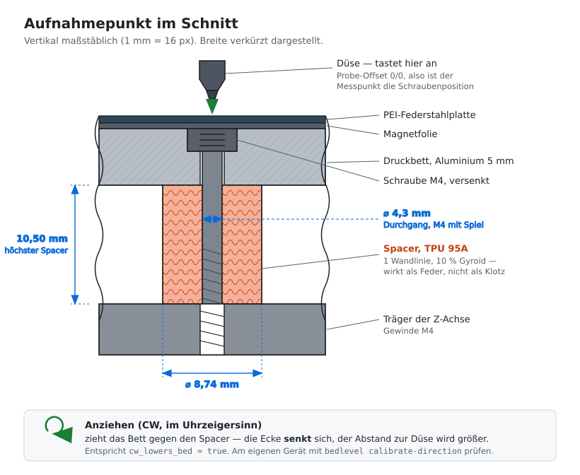

# Abstandshalter

*[English version: SPACERS.md](SPACERS.md)*

> **Der am wenigsten erprobte Teil dieses Projekts.** Der Generator entstand
> erst, *nachdem* am Testgerät bereits Spacer verbaut waren — der vollständige
> Ablauf (Ausgangslage messen, drucken, einbauen) wurde also nie am Stück
> durchlaufen. Die Rechnung und die STL-Geometrie sind durch Tests abgedeckt,
> der praktische Ablauf nicht. Betrachte ihn als begründeten Vorschlag, nicht
> als erprobtes Rezept.

Der Kobra S1 hat ab Werk **keine** Abstandshalter — das Bett liegt direkt auf
dem Träger. Der Werksversatz der vier Aufnahmepunkte muss dadurch komplett von
den Schrauben ausgeglichen werden: eine Ecke arbeitet dauerhaft nahe am
Anschlag, während eine andere kaum Vorspannung hat.

Genau daraus entstehen die Messprobleme aus
[MESSQUALITAET.md](MEASUREMENT.de.md) — eine Ecke, die unter dem Antastdruck
nachgibt oder zwischen zwei Lagen einrastet.

Gedruckte Spacer nehmen den Versatz vorweg. Die tiefste Ecke bekommt den
höchsten Spacer, die übrigen entsprechend flachere. Danach stehen alle vier
Schrauben im gleichen Bereich, und die Feinjustage hat nach beiden Seiten Luft.



Die Schraube zieht das Bett nach unten gegen den Spacer. Daher senkt Anziehen
eine Ecke — und daher muss der Spacer federnd bleiben: massiv gedruckt wäre er
ein starrer Klotz und würde die Schraubenjustage aushebeln.

## Voraussetzungen

Gemessen wird die **Ausgangslage**, nicht der schon ausgeglichene Zustand.
Sonst wird ein vorhandener Ausgleich mitgemessen und anschließend doppelt
berücksichtigt.

1. **Entweder keine Spacer verbaut, oder an allen vier Punkten dieselbe Höhe.**
   Ein Satz gleich hoher Referenzspacer ist ideal — er hält das Bett auf
   Arbeitshöhe, ohne den Versatz zu verfälschen.
2. **Alle vier Schrauben gleichmäßig angezogen**, keine am Anschlag. Gleiche
   Anzahl Umdrehungen ab Aufsetzen ist ein brauchbares Maß.
3. **Druckplatte plan aufgelegt**, Auflageflächen und Magnetunterlage sauber.

Das Kommando fragt diese Punkte ab, bevor es misst.

## Ablauf

```bash
uv run bedlevel spacers
```

1. Rückfrage zu den Voraussetzungen (mit `--yes` überspringbar)
2. Aufheizen, Düse reinigen, referenzieren
3. Messen mit verschränkten Durchgängen, 8 Messungen je Punkt
4. Prüfung, ob die Messung trägt — bei zwei Lagen oder Drift **bricht es ab**,
   statt den Fehler in Hardware zu gießen
5. Höhen berechnen, STL-Dateien nach `spacers/` schreiben
6. `spacers/aufmass.json` mit allen Einzelwerten für die Nachvollziehbarkeit

`--dry-run` rechnet nur und schreibt nichts.

## Berechnung

Ein tief liegender Aufnahmepunkt braucht mehr Material. Die tiefste Ecke
bekommt die volle Bauhöhe, jede andere wird um ihren Höhenvorsprung gekürzt:

```
Höhe_i = max_height − (z_i − z_min) / (1 − compression)
```

Beispiel mit `max_height = 10.5`:

| Punkt | gemessen | Vorsprung | Spacerhöhe |
|---|---:|---:|---:|
| vorne links | −0,780 | +0,000 | **10,50 mm** (höchster) |
| vorne rechts | −0,520 | +0,260 | 10,24 mm |
| hinten rechts | −0,610 | +0,170 | 10,33 mm |
| hinten links | −0,655 | +0,125 | 10,38 mm |

Ergibt sich für einen Punkt eine Höhe ≤ 0, bricht das Kommando ab: dann ist
`max_height` kleiner als der Versatz und muss erhöht werden.

## Geometrie

| | |
|---|---|
| Außendurchmesser | 8,74 mm |
| Innendurchmesser | 4,30 mm (M4 mit Spiel) |
| Ringwand | 2,22 mm |
| Höchster Spacer | 10,50 mm |
| Volumen (10,5 mm) | 477 mm³ |

Alle Werte stehen unter `[spacer]` in `bedlevel.toml` und lassen sich an andere
Aufnahmen anpassen. `segments` steuert die Umfangsauflösung; 128 ergibt bei
8,74 mm rund 0,2 mm Sehnenlänge.

Das erzeugte Netz ist wasserdicht und wird gegen die analytische Volumenformel
geprüft (Abweichung 0,04 % bei 128 Segmenten, reine Polygonnäherung des
Kreises).

## Druckparameter

| | |
|---|---|
| Material | TPU 95A |
| Wandlinien | 1 |
| Infill | 10 % Gyroid |
| Geschwindigkeit | 15–25 mm/s |
| Support | keiner nötig |

**Warum so wenig Material:** Die Ringwand ist 2,22 mm breit. Bei einer
0,4-mm-Düse bleiben nach je einer Außen- und Innenlinie rund 1,4 mm für das
Gyroid. Das macht den Spacer zur **Feder**, die die Vorspannung hält, statt sie
zu blockieren. Ein massiv gedruckter Spacer wäre ein starrer Klotz und würde
die Schraubenjustage aushebeln.

**Alle vier zusammen in einem Auftrag drucken.** Gleiche Düsentemperatur,
gleiche Schichtzeit, gleiches Abkühlen — getrennt gedruckt unterscheiden sich
die Federraten, und der Ausgleich stimmt nicht mehr.

100 % Bodenschicht, keine Brücken nötig (reine Rohrgeometrie). Retraction bei
TPU niedrig halten, Direktextruder bevorzugt.

Die Dateien heißen nach Punkt und Höhe, z. B.
`spacer_hinten_links_10.50mm.stl` — beim Einbau nicht verwechseln.

## Einbau

1. Spacer den Punkten zuordnen (Dateiname), Bett abnehmen, Spacer auflegen.
2. Schrauben gleichmäßig anziehen, alle im gleichen Bereich.
3. Erst dann die Feinjustage: `uv run bedlevel level`.

Die Spacer bringen die Grobkorrektur, die Schrauben den Rest. Eine
Restabweichung nach dem Einbau ist normal — sie sollte aber deutlich kleiner
sein als vorher, und vor allem sollten alle vier Schrauben vergleichbar weit
eingedreht sein.

## Setzverhalten und Nachkorrektur

TPU mit 10 % Infill gibt unter Vorspannung nach, und zwar nicht gleichmäßig:
ein hoher Spacer wird stärker gestaucht als ein flacher, wodurch die eingebaute
Höhendifferenz kleiner ausfällt als die gedruckte.

Vorgehen: nach dem Einbau ein paar Aufheizzyklen abwarten, dann
`uv run bedlevel measure`. Bleibt eine systematische Restabweichung in
derselben Richtung wie der ursprüngliche Versatz, war die Stauchung der Grund.
Dann `compression` schätzen (Restabweichung geteilt durch ursprünglichen
Versatz) und einen zweiten Satz drucken.

Für den ersten Satz `compression = 0` lassen — vorher ist der Wert nicht
seriös zu schätzen.
